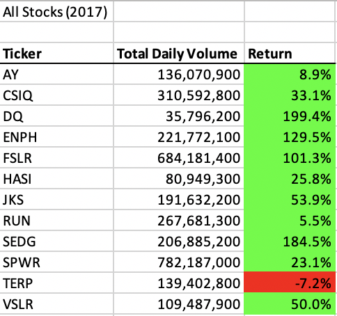
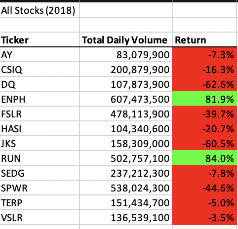
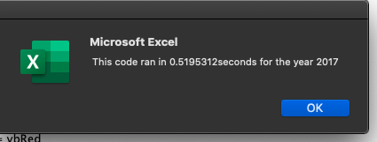
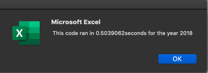
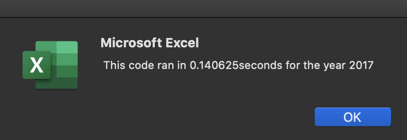
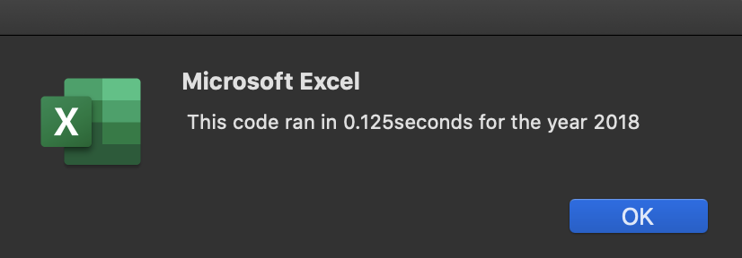

# Stock Analysis Using VBA

## Overview Of Project
The purpose of this analysis was to compare the return in stocks so that we can come to a conclusion on where to invest. After that the challenge was to refactor it. 

## Results

2017                       |  2018
:-------------------------:|:-------------------------:
  | 

The 2018 stock return did alot worst than 2017. Only two places had a positive return compared to 2017 where only one place returned in the negative.

## Run Time Comparisons

2017 Original              |  2018 Original
:-------------------------:|:-------------------------:
  | 

Originally it took around .5 seconds to run each script

2017 Refactored            |  2018 Refactored
:-------------------------:|:-------------------------:
  | 

After refactoring the new time was much faster. 

## Summary

The disadvantages of refactoring code is having to go through and change something that works at the risk of breaking it. On the flip side an advantage is having something that works more efficiently than before.

For this particular code refactoring came in handy because I can now run this 80% faster which means if I had a larger data set i wanted to run it wouldnt be too slow. 

